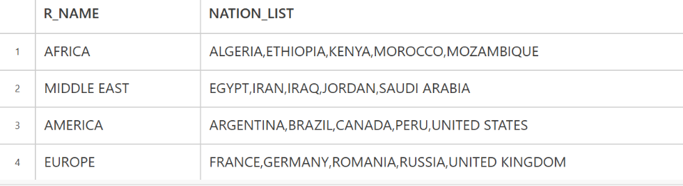

# Grouping and Aggregates.

This chapter outlines the key concepts and techniques involved in using the **GROUP BY** clause in Snowflake databases. It highlights the importance of storing data at the appropriate granularity level and the ability to group data to meet diverse business requirements.

This emphasizes the use of the **GROUP BY** clause to group rows based on common values in specific columns, and the application of aggregate functions like **SUM()** and **COUNT()** to calculate totals and counts within each group. Additionally, it introduces the **HAVING clause,** which allows for filtering results based on conditions applied to grouped data.

An example is provided to illustrate the practical application of these concepts. The example demonstrates how to identify top customers in a database based on their spending and order frequency. The steps involved include grouping orders by customer, calculating total sales and number of orders for each customer, and filtering the results using the HAVING clause to select customers meeting specific criteria.

In conclusion, the summary effectively conveys the power and versatility of the GROUP BY clause in Snowflake databases. By understanding and applying these concepts, users can gain valuable insights from their data and make informed business decisions.

### Example 1

```
select o_custkey

from orders

group by o_custkey
```


This query has returned 66,076 rows, which is the number of distinct custkey values
on the Orders table. This is an improvement over looking through all 115,000 orders,
but not by much. The next step is to count the number of orders and sum the total
price of all orders for each customer. This can be accomplished by using the aggregate
functions sum() and count(), which will be applied to all the rows within each group:

### Example 2
 
```
select o_custkey,

sum(o_totalprice) as total_sales,

count(*) as number_of_orders

 from orders
 
 group by o_custkey;
 ```

 


 The query calculates the total sales and number of orders for each customer. For example, customer 77194 placed 3 orders totaling over $693,070. However, the query is still returning too many rows.

### Example 3
```
select o_custkey,

sum(o_totalprice) as total_sales,

count(*) as number_of_orders

from orders

group by o_custkey

having sum(o_totalprice) >= 1800000

 or count(*) >= 8;
 ```

 To find top customers, filter out rows with total sales less than $1,800,000 or fewer than 8 orders. Use a having clause to filter grouped data, not a where clause.


 ### AGGREGATE FUNCTION

 Aggregate functions compute values across entire groups of data. For instance, they can count rows, sum numeric fields, or calculate averages. If your query doesn't use a GROUP BY clause, it still groups the entire result set. Here's an example showing various aggregate functions applied to all rows in the Orders table.

 ### Example 4
 ```
 select count(*) as num_orders,

 min(o_totalprice) as min_price,

 max(o_totalprice) as max_price,

 avg(o_totalprice) as avg_price

 from orders;
```

 

 This query counts the number of orders and determines the minimum, maximum,
and average totalprice value across all rows in the table. Let’s say you want to
extend this query to show the same calculations for each year rather than across the
entire table:
 
 ### Example 5
 ```
select date_part(year, o_orderdate) as order_year,

 count(*) as num_orders,

 min(o_totalprice) as min_price,

 max(o_totalprice) as max_price,

 avg(o_totalprice) as avg_price

 from orders

 group by date_part(year, o_orderdate);
 ```

 


 You can use aggregate functions without a GROUP BY clause if you're applying them to every row in the result set. Otherwise, you'll need a GROUP BY clause that includes all non-aggregate columns in your SELECT clause.

### Count() function
count(DISTINCT column_name) counts the distinct values in a column.

### Example 6

```
 select count(*) as total_orders,

 count(distinct o_custkey) as num_customers,

 count(distinct date_part(year, o_orderdate)) as num_years

 from orders;
 ```

 


count_if(condition) counts rows where a given condition is true.

### Example 7
```
select 

count_if(1992 = date_part(year, o_orderdate)) num_1992,

count_if(1995 = date_part(year, o_orderdate)) num_1995

from orders

```

 


 ### min(), max(), avg(), and sum() Functions.

 max(), min(), avg(), and sum() are aggregate functions used to find the maximum, minimum, average, and sum of values within a group, respectively.

 ### Example 8
 ```

 select date_part(year, o_orderdate) as year,

 min(o_orderdate) as first_order,

 max(o_orderdate) as last_order,

 avg(o_totalprice) as avg_price,

 sum(o_totalprice) as total_sales

 from orders

 group by date_part(year, o_orderdate);
 ```

 

### Listagg() Function

listagg() is an aggregate function that creates a delimited list of values from a column.

 ### Example 9
 ```

 select r.r_name,

 listagg(n.n_name,',') 

 within group (order by n.n_name) as nation_list

 from region r inner join nation n

 on r.r_regionkey = n.n_regionkey

 group by r.r_name; 
 ```

 

The listagg() function creates a comma-delimited list of Nation names for each Region, sorted alphabetically. The ORDER BY clause inside listagg() sorts the list within the function itself.


### Multicolumn grouping.
You can group data on multiple columns. This example counts customers by country and market segment for customers in the Amer
### Example 10

```
select n.n_name, c.c_mktsegment, count(*)

from customer c inner join nation n

on c.c_nationkey = n.n_nationkey

where n.n_regionkey = 1

group by n.n_name, c.c_mktsegment

order by 1,2
```


### Grouping Using Expressions

You can use multiple expressions in your GROUP BY clause to create more complex groupings. This example groups data by the year of the order and the number of months between the order and ship dates.

### Example 11

```
select date_part(year, o.o_orderdate) as year,

datediff(month, o.o_orderdate,

l.l_shipdate) as months_to_ship,

count(*)

from orders o inner join lineitem l
on o.o_orderkey = l.l_orderkey
where o.o_orderdate >= '01-JAN-1997'::date
group by date_part(year, o.o_orderdate),
datediff(month, o.o_orderdate, l.l_shipdate)
order by 1,2;
```


### Group By All

Snowflake's GROUP BY ALL option is a shortcut for grouping data using expressions.

### Example 12
```

 select date_part(year, o.o_orderdate) as year,
 datediff(month, o.o_orderdate,
 l.l_shipdate) as months_to_ship,
 count(*)
 from orders o inner join lineitem l
 on o.o_orderkey = l.l_orderkey
 where o.o_orderdate >= '01-JAN-1997'::date
 group by all
 order by 1,2;
```


### Grouping rollup

Let’s say that along with the counts for each country and market segment, you also
want to know the total counts for each country across all market segments. This can
be accomplished using the rollup option of the group by clause:

### Example 13
```
select n.n_name, c.c_mktsegment, count(*)
 from customer c inner join nation n
 on c.c_nationkey = n.n_nationkey
 where n.n_regionkey = 1
 group by rollup(n.n_name, c.c_mktsegment)
 order by 1,2;
 ```

 

 The rollup option generated six additional rows: one for each country, and a final
row showing the total number of rows across the entire result set. The additional
rows show null for the column that is being rolled up.

### Filtering on Grouped Data

To find customers with total sales over $700,000 in 1998, first group data by customer and calculate total sales.

### Example 14

 ```
 select o_custkey, sum(o_totalprice)
 from orders
 where 1998 = date_part(year, o_orderdate)
 group by o_custkey
 order by 1;
 ```


